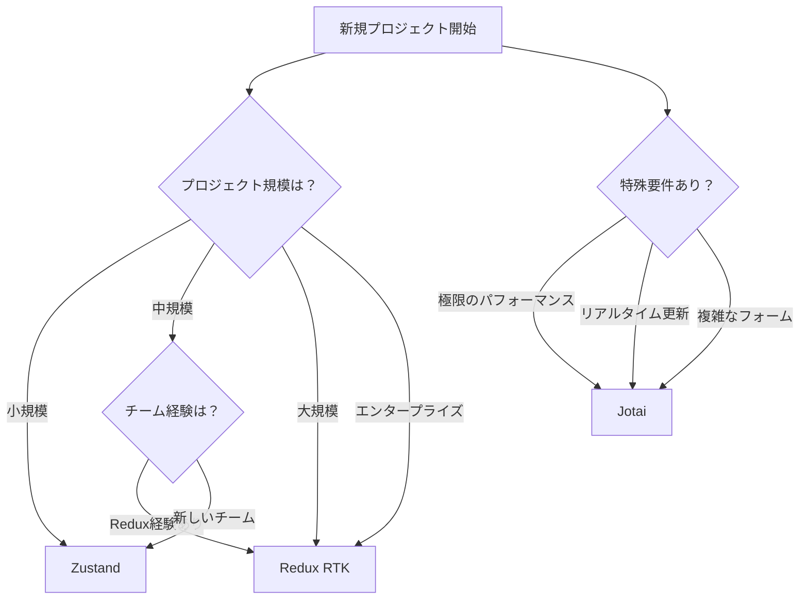

# React状態管理ライブラリ最終推奨事項 (2025年版)

## 🎯 エグゼクティブサマリー

プロダクトの状態管理ライブラリ選択において、**万能な解決策は存在しません**。
Redux、Zustand、Jotaiはそれぞれ異なる強みを持ち、プロダクトの特性に応じて選択すべきです。

### 📊 クイック選択ガイド



## 🔍 詳細な選択基準

### 1. Redux (Redux Toolkit)を選ぶべきケース

**適している場合:**
- 🏢 50画面以上の大規模アプリケーション
- 👥 10人以上の開発チーム
- 📊 複雑なビジネスロジックと状態遷移
- 🔍 厳格なデバッグとトレーサビリティが必要
- 🏦 金融、医療などの規制産業
- 📚 既存のReduxコードベースがある

**実際の採用事例:**
- Airbnb（グローバル状態管理）
- 大手金融機関の取引システム
- エンタープライズCRM/ERPシステム

**具体的な実装パターン:**
```typescript
// Redux Toolkitの推奨構成
features/
  auth/
    authSlice.ts
    authAPI.ts
  products/
    productsSlice.ts
    productsAPI.ts
app/
  store.ts
  hooks.ts
```

### 2. Zustandを選ぶべきケース

**適している場合:**
- 🚀 開発スピードを重視
- 📱 中規模のSPAやPWA
- 🎨 管理画面やダッシュボード
- 👨‍💻 5人以下の小〜中規模チーム
- 🔄 Reduxからの移行を検討
- ⚡ 適度な複雑性とパフォーマンス

**実際の採用事例:**
- Hotjar（ユーザー分析ツール）
- 中規模SaaSプロダクト
- スタートアップの管理画面

**具体的な実装パターン:**
```typescript
// Zustandの推奨構成
stores/
  useAuthStore.ts
  useProductStore.ts
  useUIStore.ts
hooks/
  useStoreSelectors.ts
```

### 3. Jotaiを選ぶべきケース

**適している場合:**
- ⚡ 極限のパフォーマンスが必要
- 📝 複雑なフォームやエディター
- 🔄 リアルタイムコラボレーション
- 🎯 細かい状態の独立管理
- 🧩 コンポーネント単位の状態
- 🚦 頻繁な部分更新

**実際の採用事例:**
- コードエディター（リアルタイム更新）
- 複雑なデータ入力フォーム
- インタラクティブなダッシュボード

**具体的な実装パターン:**
```typescript
// Jotaiの推奨構成
atoms/
  primitiveAtoms.ts
  derivedAtoms.ts
  asyncAtoms.ts
hooks/
  useAtomSelectors.ts
```

## 💰 コスト対効果分析

### 初期導入コスト
```
低い順: Zustand < Jotai < Redux
```

### 長期保守コスト
```
低い順: Redux < Zustand < Jotai
（大規模プロジェクトの場合）
```

### 開発者採用コスト
```
容易順: Redux > Zustand > Jotai
（Redux経験者が最も多い）
```

## 🚨 アンチパターンと注意点

### Redux
❌ 小規模プロジェクトでの採用
❌ すべての状態をグローバル化
❌ 正規化しすぎる

### Zustand
❌ 大規模チームでの無秩序な使用
❌ ストアの過度な分割
❌ 型安全性の軽視

### Jotai
❌ 過度に細かいアトム分割
❌ 派生アトムの乱用
❌ 初心者チームでの採用

## 🔄 段階的移行戦略

### 既存プロジェクトでの導入

1. **パイロットフェーズ**
   - 新機能で新ライブラリを試験導入
   - パフォーマンス計測とチーム習熟度確認

2. **部分移行フェーズ**
   - ボトルネック部分から順次移行
   - 既存コードとの共存期間を設ける

3. **完全移行フェーズ**
   - 段階的に既存コードを置き換え
   - 移行完了後の最適化

## 📈 2025年のトレンドと将来予測

### 市場動向
- **Zustand**: 急成長継続（前年比+50%）
- **Redux**: 安定的な利用継続
- **Jotai**: ニッチながら着実な成長

### 技術トレンド
- Server Componentsとの統合強化
- AIアシスタントによる状態管理支援
- より宣言的なAPIへの進化

## 🎯 最終推奨マトリクス

| プロダクト特性 | 第一選択 | 第二選択 | 避けるべき |
|--------------|---------|---------|-----------|
| スタートアップMVP | Zustand | Context API | Redux |
| 中規模SaaS | Zustand | Redux RTK | - |
| エンタープライズ | Redux RTK | Zustand | Jotai（全体） |
| リアルタイムアプリ | Jotai | Zustand | Redux |
| Eコマース | Redux RTK | Zustand | Jotai（全体） |
| 管理画面 | Zustand | Redux RTK | - |

## 🏁 結論

### 基本方針
1. **迷ったらZustand**: バランスが良く失敗しにくい
2. **大規模ならRedux**: 実績と安定性を重視
3. **性能ならJotai**: 特定用途で威力を発揮

### チェックリスト
- [ ] プロジェクト規模を明確化
- [ ] チームの技術スタックを確認
- [ ] パフォーマンス要件を定義
- [ ] 将来の拡張性を検討
- [ ] 移行コストを試算

### 最重要ポイント
**技術選定は手段であり目的ではありません。**
プロダクトの成功に最も貢献する選択をすることが重要です。

---

*この推奨事項は2025年1月時点の情報に基づいています。
技術の進化に応じて定期的な見直しを推奨します。*